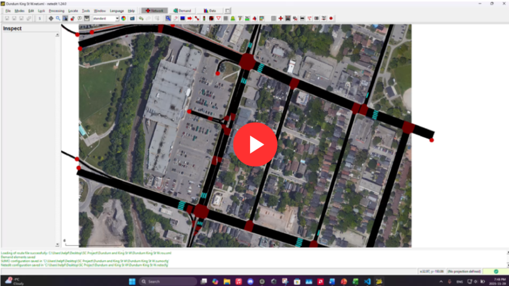

# Reducing Vehicle Delay Through Signal Timing Optimization
### A SUMO-Based Study of Hamilton Intersections
**McMaster University — W Booth School of Engineering Practice and Technology**
> Tsz Lok Erin Ng, Yara Idris, Luc Suzuki

---

## 📌 Overview
Urban intersections using fixed-time traffic signals often cause excessive vehicle delays
during peak hours. This project investigates how Reinforcement Learning (RL) algorithms
can dynamically optimize traffic signal timing to reduce vehicle delay, queue length, and
improve throughput — simulated using real Hamilton, Ontario intersections.

---

## 🎯 Objectives
- Optimize green and yellow phase durations using RL to outperform static/fixed-time signals
- Compare proposed algorithms (SARSA, A2C) against established baselines (Q-Learning, DQN)
- Evaluate performance across single and multi-intersection environments

---

## 🧠 Algorithms Used

| Algorithm | Type | Best For |
|---|---|---|
| **SARSA** | On-policy, Single-Agent | Single intersection, stable/conservative control |
| **Q-Learning** | Off-policy, Single-Agent | Single intersection, fast convergence |
| **A2C** | Multi-Agent Actor-Critic | Multi-intersection, large-scale networks |
| **DQN** | Deep Q-Network, Multi-Agent | Multi-intersection, fixed/simple demand |

All algorithms are framed using the **Markov Decision Process (MDP)**.

---

## 🛠️ Tools & Applications

### SUMO (Simulation of Urban MObility)
- Open-source microscopic traffic simulator
- Models vehicle-level behavior: acceleration, lane-changing, queue formation
- Configured using three files:
  - `.net.xml` — road network layout
  - `.rou.xml` — vehicle demand and routes
  - `.add.xml` — lane detectors and additional elements

### TraCI (Traffic Control Interface)
- Connects Python RL scripts to the SUMO engine in real-time
- Observes traffic states (queue length, delays) and adjusts signal phases each time step

### Python
- Implements all RL algorithm backends (SARSA, Q-Learning, A2C, DQN)
- Runs training loops and collects performance metrics

### Matplotlib & CSV
- Visualizes training results (delay, queue length, throughput) across episodes
- Stores logged data for post-experiment analysis

---

## 🔬 Experiments

### Experiment 1 — Single Intersection (3-lane, 4-way)
- **Algorithms:** SARSA vs. Q-Learning vs. Fixed-time (TraCI)
- **Episodes:** 50
- **Result:** SARSA achieved the lowest average vehicle delay, converging more stably than Q-Learning due to its on-policy, conservative learning approach

### Experiment 2 — Multi-Intersection (Dundurn St & King St W, Hamilton)
- **Algorithms:** A2C vs. Decentralized DQN vs. Fixed-time (TraCI)
- **Episodes:** 20
- **Result:** DQN outperformed A2C on this network (mean delay ~25–37s vs. ~55–83s), as the fixed demand and small scale (4 intersections) favoured DQN's deterministic approach

---

## 📊 Key Findings
- **SARSA** is the best overall performer for single-intersection control
- **DQN** is more effective for small, fixed-demand multi-intersection networks
- Both RL approaches significantly outperform fixed-time signal control
- A2C shows promise for larger, more complex networks where stochastic exploration is beneficial

---

## 🔭 Future Research
- Test with dynamic demand flows (peak vs. off-peak simulation)
- Incorporate real-world data (incidents, weather, highway conditions)
- Fine-tune RL hyperparameters for improved performance
- Scale to larger road networks to better leverage A2C's multi-agent capabilities

---

## 📚 References
- Kamble & Kounte (2020) — ML-based traffic congestion monitoring using GPS/IoV data
- Hajbabaie & Benekohal (2013) — Traffic signal timing objective function optimization
- Ouyang et al. (2024) — Comparative study of RL algorithms for traffic signal control
- Chu et al. (2019) — Scalable A2C for large-scale traffic networks
